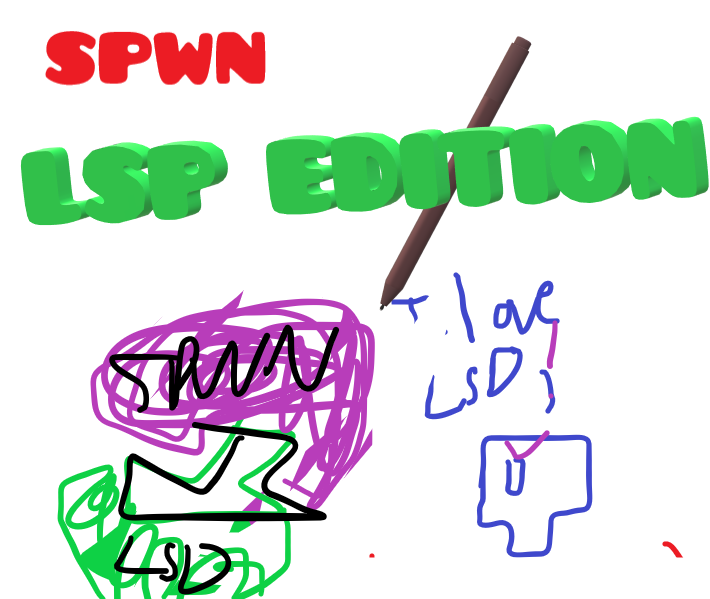

# SPWN LSP

an alpha LSP for spwn

## developing for vscode

1. clone repo / your fork
2. open the included code workspace
3. run `cargo install --debug --path .` in the root
4. go into clients/code and run `npm i` and then `npm run compile`
5. launch the debugger for the client
6. whenever you make a change to the rust code, stop the debugger, run `cargo install --debug --path .`, and then start it up again

video:

https://www.youtube.com/watch?v=1_ghNCAg0cM

